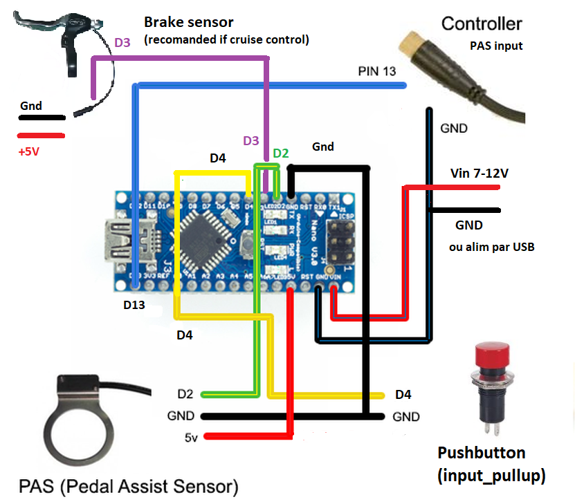

# Button to PAS
Arduino e-bike button to PAS (boost)\
Use a push-button to simulate pedaling on an e-bike \
(or replicate the PAS sensor when pedaling with no push)

> Cruise control mode in option (see constants setting)

**more informations, see**   
- [Throttle to PAS](https://github.com/Chris741233/throttle-to-PAS)
- [PAS analyzer](https://github.com/Chris741233/PAS_analyzer)

#### Utilisation
Régler les constantes en début de code \
*Adjust constants at the beginning of code*

- Choisir si le mode cruise doit être actif ou pas (*true or false*)
- Choisir le nb. d'aimants *"nb_magnets"* sur votre disque de PAS 
- Choisir le RPM moyen de simulation de pédalage *"simul_rpm"*
- Adapter le duty-cycle high *"duty_cycle"* selon votre modèle de PAS (A ou B, voir "more informations")
- That's all :-)

---

#### Wiring (Arduino Uno/Nano)

  

#### Discussion sur le forum Cyclurba :
[Cyclurba](https://cyclurba.fr/forum/forum_discussion.php?from=11&discussionID=31032&messageID=741856&rubriqueID=87)
---

#### Note
  
> *La réglementation de certains pays n'autorise pas l'utilisation d'un accélérateur à plus de 6 km/h sans pédaler.*
*L'utilisation de ce code et schéma sont sous votre propre responsabilité !* 

> *The regulations of some countries do not allow the use of an accelerator at more than 6 km/h without pedaling.*
*The use of this code and diagram is under your own responsibility!*

